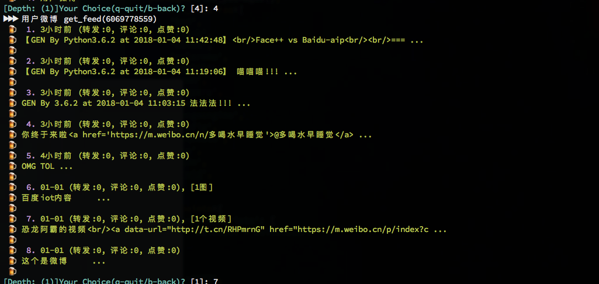
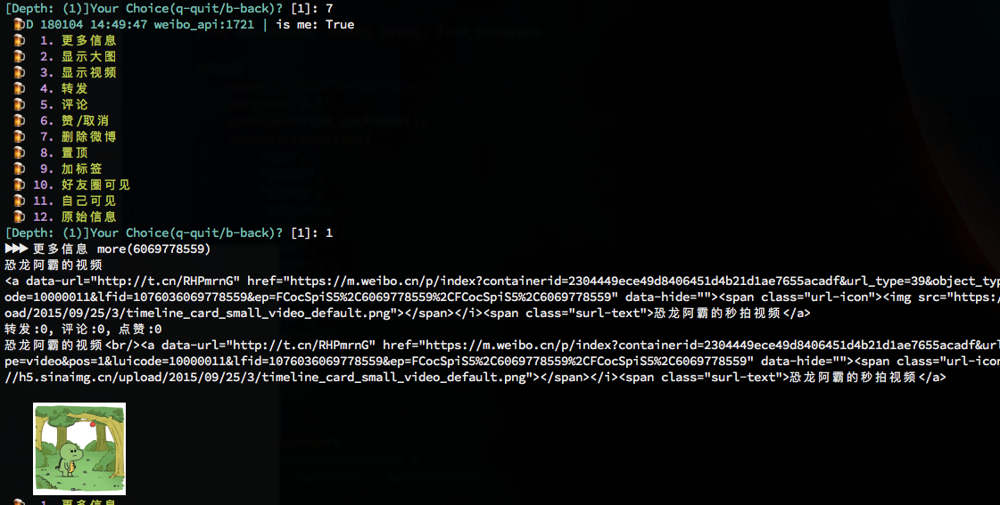
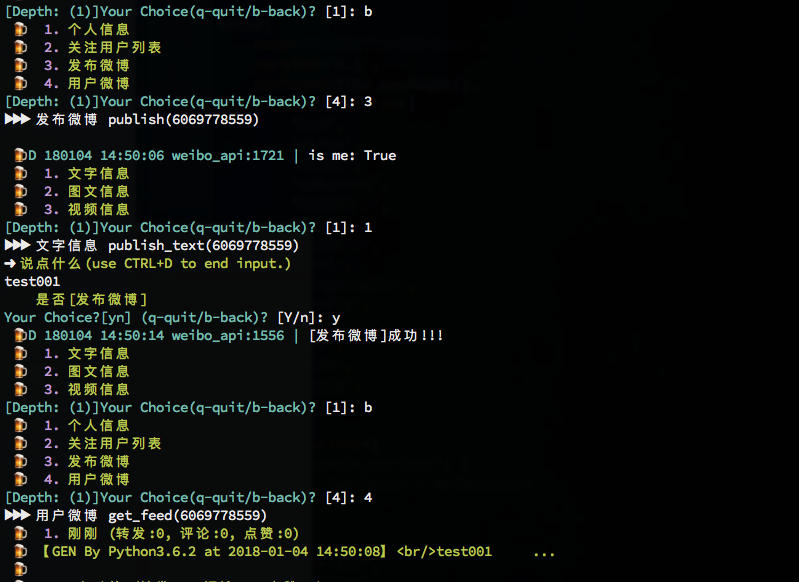

# sinaweibo.cmd

新浪微博命令行版本, sina.com on iterm2 with cmd line support

## 功能列表

### 个人操作

- [x] 登陆
      - [x] `web登陆`
      - [x] `mobile登陆`
- [x] 展示个人信息
      - [x] 个人信息
      - [x] 关注用户列表
- [x] 微博操作
      - [x] 发布微博
      - [x] 查看微博
- [x] 发布微博
      - [x] 文字/图文/视频
- [x] 查看微博
      - [x] 详情`小图`
      - [x] 大图
      - [x] 视频
      - [x] 转发
      - [x] 评论
      - [x] 赞/取消
      - [x] 删除
      - [x] 收藏/取消
      - [ ] 置顶
      - [ ] 加标签
      - [ ] 好友圈可见
      - [ ] 自己可见

### 好友操作

- [x] 查找
- [x] 查看好友信息
- [x] 关注/取关


## 分析实现

- 所有功能均通过`firefox`的`web`及`firefox响应设计模式模拟手机设备`实现
- 只支持查看已关注账号信息

## 操作演示

### 按键说明

```sh
q/Q	# 退出
b/B	# 后退一级
# 其他
1~n # 数字对应功能
```

### 帮助提示

```sh
weibocli --help
```


### 登陆

```sh
weiboocli -lg
weiboocli -mlg
```


### 个人信息/关注列表

```sh
# 无 -id 参数为查看自己的, 加上 -id 为查看id对应的用户
weibocli
1
2
```


### 微博列表

```sh
4
```



> 详情



### 发布微博

```sh
3
```

