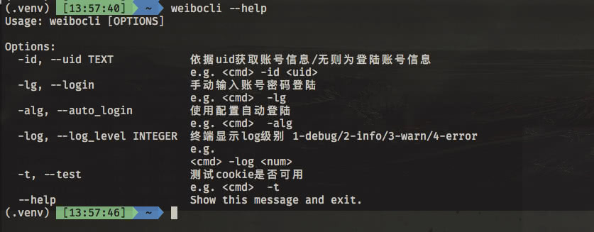
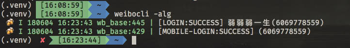
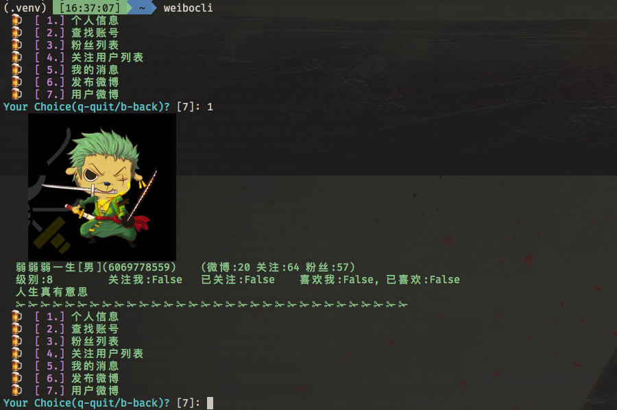
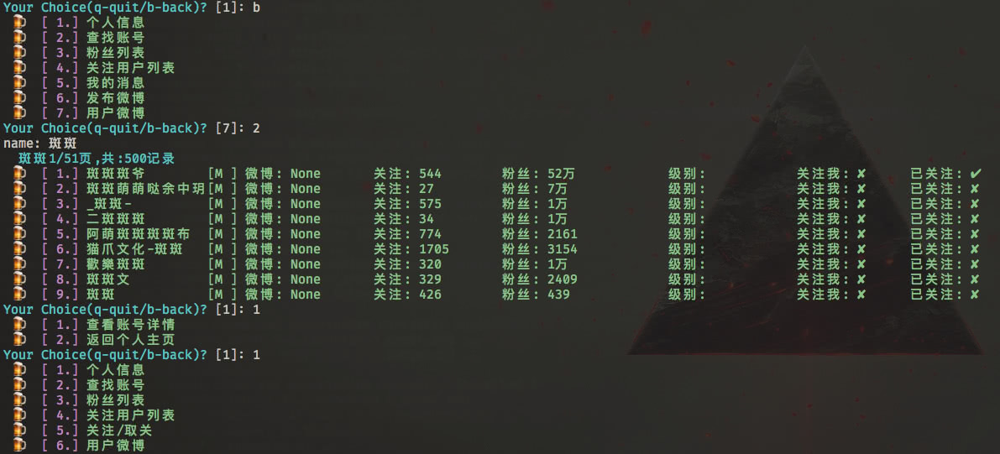
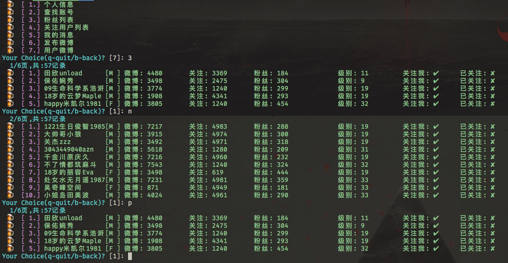
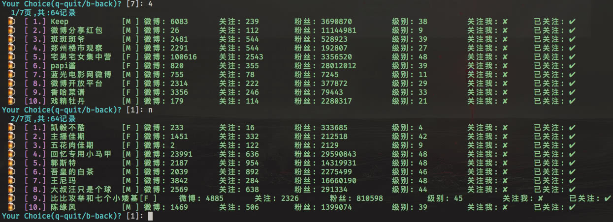

# sinaweibo.cmd

新浪微博命令行版本, sina.com on iterm2 with cmd line support

## 1. 功能列表

### 1.1 登陆

- `web登陆`

- `mobile登陆`

### 1.2 终端cli功能

- [ 1 ] 个人信息
- [ 2 ] 查找账号
- [ 3 ] 粉丝列表
- [ 4 ] 关注用户列表
- [ 5 ] 我的消息
- [ 6 ] 发布微博
- [ 7 ] 用户微博

## 2. 分析实现

- 所有功能均通过`firefox`的`web`及`firefox响应设计模式模拟手机设备`实现

## 3. 终端操作演示

### 3.1 按键说明

```sh
q/Q	# 退出
b/B	# 后退一级
n/p # next 下一页/ previous下一页
# 其他
1~x # 数字对应功能
```

### 3.2 帮助提示

```sh
weibocli --help
```



### 3.3 登陆

```sh
weiboocli -lg
weiboocli -alg
```

#### 3.3.1 手动输入登陆


#### 3.3.2 使用配置项自动登陆



## 4 个人操作cli

### 4.1 查看个人信息

```sh
# 无 -id 参数为查看自己的, 加上 -id 为查看id对应的用户
weibocli
1
```



### 4.2 查找用户

```sh
2
```



### 4.3 查看粉丝

```sh
3
n	// 下一页
p	// 上一页
```



### 4.4 查看关注用户

```sh
4
n
p
```



### 4.5 查看未读消息

- `to be 实现`

### 4.6 发布微博

```sh
6
```


### 4.7 查看微博

```sh
7
1
3
```

